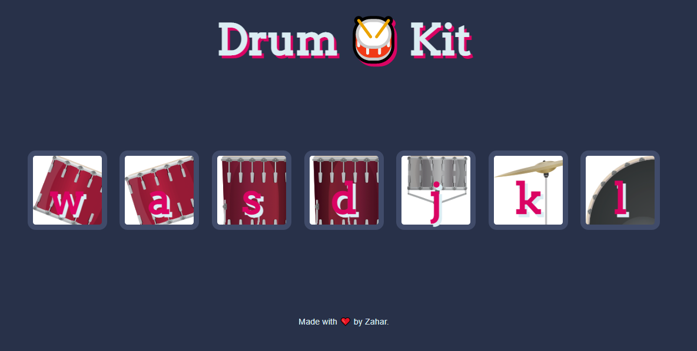

<h3>Visit the Site</h3> https://zaharsm.github.io/drumkit/   

<h3>Information </h3> this is developed using  concept like Advanced Javascript + AddEventListener + DOM

<h3>Features </h3> This basically makes noise when the button is clicked  

<h3>Tech Stack </h3>  

1) Advanced Javscript 2) DOM 3) AddEventListner 4) OnClickEvent

  

 
